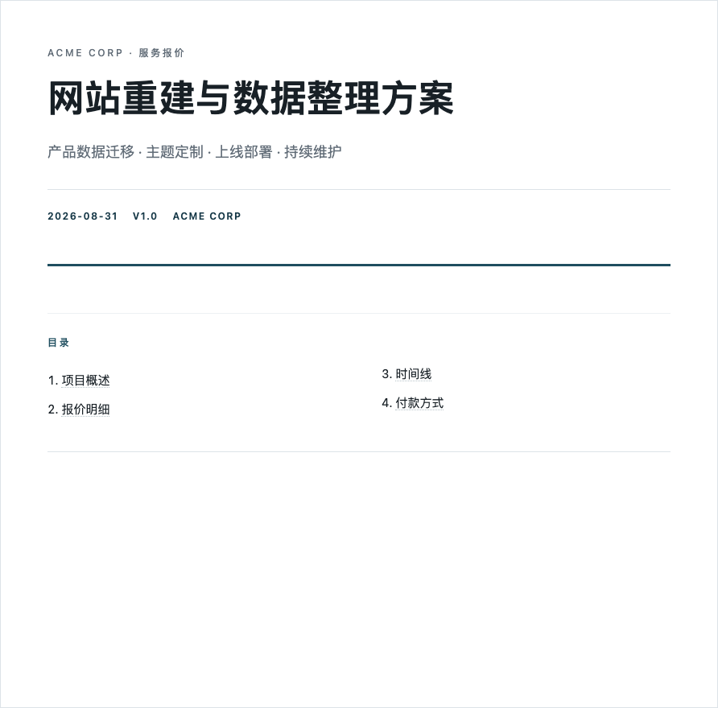

# paged-report

> Generate professional client-facing HTML reports with A4-oriented print styles and self-contained HTML. PDF page fit and physical page count depend on the target browser, print settings, and content.

A [Hermes Agent](https://hermes-agent.nousresearch.com) skill that turns structured data into printable HTML reports using a shared CSS design system and 14 catalog entries (10 typed components plus structural hero, TOC, section, and footer).

## Features

- **14 catalog entries** — 10 typed components plus structural hero, TOC, section, and footer
- **5 accepted family labels** — proposal, data-audit, progress, confirmation, handoff; family-specific rendering policies are not yet enforced
- **A4 print styles** — `@page { size: A4 }`, page-break hints, table header repeat, orphan/widow controls; verify physical output in the target browser
- **Short page layout** — flex styling can fill spare screen space and place a footer after content when it fits; content can reflow or span pages
- **Self-contained HTML** — one file, all CSS inline, no external dependencies
- **PDF via Kimi WebBridge** — recommended interactive/PDF preview path using `save_as_pdf(paper_format: "a4")`; verify the resulting PDF
- **Bilingual ready** — `lang="zh-CN"` or `lang="en"`, same template
- **Hermes prompt-cache friendly** — static CSS and component guidance are reusable; actual caching depends on the host
- **Structured generator** — validate JSON input and render one self-contained HTML file with the same design system

## Quick start (Hermes users)

```bash
# Install (clone to Hermes skills directory)
git clone https://github.com/mfang0126/paged-report.git ~/.hermes/skills/paged-report
```

Then in any Hermes session:

```
User: "帮我做个运费确认发给客户"
Agent: [loads paged-report skill, picks confirmation family, assembles HTML]
```

## Quick start (standalone)

1. Copy `templates/base.css` into a `<style>` tag
2. Pick components from the catalog below
3. Assemble HTML following the skeleton structure
4. Open in a browser, choose A4 when supported, save a PDF, and verify the rendered page count and layout

### JSON generator

For repeatable reports, keep content in JSON and render it with the bundled standard-library CLI:

```bash
# Run from the paged-report repository root
python3 -m generator.paged_report \
  examples/confirmation-data.json \
  --output /tmp/confirmation-generated.html
```

The contract is documented in [`schemas/report.schema.json`](schemas/report.schema.json). Text values are HTML-escaped by default; raw HTML and external assets are not part of the contract. Table cells may be strings/numbers or typed objects (`text` + optional `class`, or `tag` + optional `class`); every row must have exactly the same number of cells as `columns`. Unknown fields and duplicate section IDs are rejected.

The generator uses explicit authoring boundaries. Treat each `pages[]` entry as content intended to stay together, then validate the rendered HTML/PDF: a logical page boundary does not guarantee one physical page, and long content can overflow or create an extra page.

The optional data-appendix and package-delivery manifest are currently proposed contracts, not implemented runtime features. See the [review-pending design](https://github.com/mfang0126/paged-report/blob/main/docs/reports/paged-report-appendix-delivery-spec-2026-09-07.md) for the contract; it is development documentation, not runtime package content.

## Package boundary

The generic release boundary is recorded in [`release/manifest.json`](release/manifest.json). It includes the standard-library renderer, schema, templates, documentation, and sanitized generic HTML/data examples. Customer/domain fixtures, QA evidence, local state, tests, and development-only material are explicit exclusions rather than generic package content.

The current manifest is marked `development` / `review-pending` / `migration-blocked`; the package has no stable tag or customer-release approval yet.

The existing PDF and PNG previews remain in the checkout as visual evidence, but are excluded from the generic release until regenerated from sanitized fixtures. The manifest is the source of truth for what may be packaged.

The generic allowlist includes [`.github/workflows/ci.yml`](.github/workflows/ci.yml), a GitHub Actions workflow whose project checks use only the Python standard library and which is configured for pushes and pull requests. Its configuration does not claim a remote CI run or release approval.

The runtime renderer has no third-party dependency. Browser/PDF tooling is an external adapter: **Kimi WebBridge is recommended for interactive work and PDF preview**; **Playwright is reserved for formal repeatable E2E checks**, not the quick preview path. Any PDF still needs a physical-page and visual verification step in its target browser.

## Template families

| Family | Use when | Planning range (not enforced) |
|--------|----------|----------------|
| **proposal** | Quote, pricing, service proposal | 3-7 pages |
| **data-audit** | Data quality, catalog audit, CSV analysis | 5-10 pages |
| **progress** | Status update, milestone, weekly report | 2-5 pages |
| **confirmation** | Rule change, shipping, delivery confirmation | 1-2 pages |
| **handoff** | Technical delivery, import prep, acceptance | 2-8 pages |

## Components

| Component | When | Key class |
|-----------|------|-----------|
| Hero | Cover page, always first | `.hero` |
| TOC | 3+ sections | `.toc` |
| Section | Logical content block | `section` |
| Grid + Card | Parallel items | `.grid`, `.card` |
| Callout (4 colors) | Info/success/warning/error | `.callout`, `.green`, `.amber`, `.red` |
| Table | Multi-row data | `table`, header-repeat rule (verify in target PDF) |
| Compare Table | Before/after | `.compare-table` |
| Tag | Inline status | `.tag`, `.green`, `.blue`, `.amber`, `.red` |
| KPI | Big number | `.kpi` |
| Progress Bar | Percentage | `.progress-bar` |
| Status Row | Compact list | `.status-row` |
| Checklist | Action items | `.checklist` |
| Footer | Generated for each logical content page; verify physical placement | `.footer` |
| Divider | Visual break | `hr` |

See [`templates/component-catalog.html`](templates/component-catalog.html) for a visual reference with all components rendered.

## HTML skeleton

```html
<!DOCTYPE html>
<html lang="zh-CN">
<head>
<meta charset="UTF-8">
<title>{title}</title>
<style>{paste base.css here}</style>
</head>
<body>
<div class="page">
  <!-- Cover page -->
  <div class="report-page cover">
    <div class="hero">
      <p class="eyebrow">{client · category}</p>
      <h1>{title}</h1>
      <p class="subtitle">{description}</p>
      <div class="meta">
        <span>{date}</span><span>{version}</span>
      </div>
    </div>
    <nav class="toc">...</nav>
  </div>

  <!-- Content pages -->
  <div class="report-page flex-col">
    <div class="content-area">
      <section id="s1">
        <h2>{section title}</h2>
        {components}
      </section>
    </div>
    <div class="footer-area">
      <div class="footer"><p>{footer text}</p></div>
    </div>
  </div>
</div>
</body>
</html>
```

## Print and pagination guidance

- `@page { size: A4; margin: 18mm 16mm; }` — requests A4 paper and margins; the browser/PDF adapter must be checked
- `.report-page { min-height: 880px; }` — screen-space minimum only; print rules override it
- `.flex-col` + `.content-area { flex: 1 }` + `.footer-area { margin-top: auto }` — can push a footer after content when that logical page has spare space
- `page-break-inside: avoid` and `thead { display: table-header-group }` — print hints, not unconditional layout guarantees
- `page-break-after: always` — requests a break after each logical `.report-page`; it does not make one logical page equal one physical page when content overflows
- Print-only `.page-label, .footer` horizontal padding (`4mm`) — keeps decorative labels and footer glyphs inside the A4 content boundary when report-page padding is reset for print

A logical `.report-page` is an authoring boundary. Long sections can spill, tables can split, and browser/PDF pagination can produce a different physical page count. Split content before rendering when practical, then use the QA/evidence gate and a visual check on the target PDF.

## PDF generation

### Via Kimi WebBridge (recommended for interactive/PDF preview)

Use Kimi WebBridge for interactive inspection and quick PDF previews. Serve local files over temporary localhost HTTP when file access is unavailable, then verify the saved PDF's physical page count and layout.

```bash
# Serve /tmp/report.html from a temporary localhost HTTP server first
python3 -m http.server 8765 --bind 127.0.0.1 --directory /tmp

# Navigate to the served file (reuses same tab)
curl -s -X POST http://127.0.0.1:10086/command \
  -H 'Content-Type: application/json' \
  -d '{"action":"navigate","args":{"url":"http://127.0.0.1:8765/report.html"},"session":"report-gen"}'

# Save as A4 PDF
curl -s -X POST http://127.0.0.1:10086/command \
  -H 'Content-Type: application/json' \
  -d '{"action":"save_as_pdf","args":{"paper_format":"a4","print_background":true,"path":"/tmp/report.pdf"},"session":"report-gen"}'
```

### Via Playwright (formal repeatable E2E only)

Use Playwright when a repeatable test or CI-style assertion is required. It is not the recommended interactive/PDF preview adapter and is not a runtime dependency of this package.

```python
from playwright.sync_api import sync_playwright

def to_pdf(html_path, pdf_path):
    with sync_playwright() as p:
        browser = p.chromium.launch()
        page = browser.new_page()
        page.goto(f"file://{html_path}")
        page.pdf(path=pdf_path, format="A4",
                 margin={"top":"18mm","bottom":"18mm","left":"16mm","right":"16mm"})
        browser.close()
```

### Via browser (manual)

Open HTML → `Cmd/Ctrl + P` → choose A4 when available → Save as PDF, then verify the resulting physical page count and layout.

## Prompt-cache note

The design system and component catalog are static inputs, so a host may reuse them between calls. Hermes prompt caching and any cost/latency effect depend on the host configuration; this package does not guarantee cache behavior or a fixed token cost.

## Examples

### Proposal cover


### Confirmation cover


The generic release includes the sanitized HTML/data examples in [`examples/`](examples/). The PDF/PNG assets above remain checkout-only visual evidence until regenerated from sanitized fixtures:

- [`proposal.html`](examples/proposal.html) — generic service proposal with pricing, timeline, and terms
- [`confirmation.html`](examples/confirmation.html) — generic rule confirmation with compare table and checklist
- [`confirmation-data.json`](examples/confirmation-data.json) — structured input for the renderer
- [`confirmation-generated.html`](examples/confirmation-generated.html) — deterministic renderer output from that input

## Project structure

```
paged-report/
├── README.md              ← You are here
├── LICENSE                ← MIT
├── SKILL.md               ← Hermes skill definition
├── CHANGELOG.md           ← Release history
├── .gitignore             ← Local artifact policy
├── .github/
│   └── workflows/
│       └── ci.yml         ← Push/pull-request CI checks
├── pyproject.toml         ← Minimal project metadata
├── release/
│   └── manifest.json      ← Generic package allowlist/exclusions
├── generator/
│   ├── __init__.py        ← Python API exports
│   └── paged_report.py    ← JSON → self-contained HTML CLI
├── schemas/
│   └── report.schema.json ← Input contract
├── templates/
│   ├── base.css           ← Design system (inline into reports)
│   └── component-catalog.html  ← Visual component reference
├── tests/
│   └── test_generator.py  ← Renderer and validation tests
└── examples/
    ├── confirmation-data.json      ← Structured input example
    ├── confirmation-generated.html  ← CLI-generated self-contained output
    ├── confirmation.html           ← Generic rule confirmation
    └── proposal.html               ← Generic service proposal
```

Checkout-only PDF/PNG previews and domain evidence are intentionally omitted from the generic tree above; see [`release/manifest.json`](release/manifest.json).

## Integration with artifact-delivery

For publishing reports online:

```
JSON data → paged-report (generate) → artifact-delivery (publish)
```

1. Keep the report content in a reviewed JSON file
2. Generate HTML with `python3 -m generator.paged_report`
3. Register with `artifact-delivery/scripts/register_artifact.py`
4. Deploy with `artifact-delivery/scripts/deploy_artifacts.py`
5. Share the URL

## License

MIT
